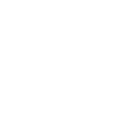

#  godot-licensing by nathanfranke

[](https://godotengine.org/asset-library/asset/1079)
[](https://github.com/nathanfranke/godot-licensing/releases/latest)
[](https://github.com/nathanfranke/godot-licensing)
[](https://github.com/nathanfranke/godot-licensing/blob/main/LICENSE)
[](https://github.com/nathanfranke/godot-licensing/actions)

Adds a preset interface that shows an interactive list of all licenses. Custom licenses can be added through the GodotLicensing singleton.

## usage

Use the `GodotLicensing` singleton to add custom copyrights and licenses (see below). \
Use the `LicensingInterface` node to show all copyrights and licenses to users.

**Note**: It is recommended to set `display/window/stretch` such that the full interface shows on all resolutions. For example, set `mode` to `canvas_items` and `aspect` to `stretch`.

**Note**: `LicensingInterface` has a minimum size of `256px` × `256px`.

## example


Example copyright with license:

```gdscript
GodotLicensing.add_copyright({
	&"name": "Example",
	&"parts": [{
		&"copyright": [
			"2024 Example"
		],
		&"license": "Example",
	}],
})
GodotLicensing.add_license({
	&"name": "Example",
	&"text": "Example text",
})
```

Example copyright without license:

```gdscript
GodotLicensing.add_copyright({
	&"name": "Example",
	&"parts": [{
		&"copyright": [
			"2024 Example"
		],
	}],
})
```

## license

This is free and unencumbered software released into the public domain. See [LICENSE](https://github.com/nathanfranke/godot-licensing/blob/main/LICENSE) for details.

## maintenance

```sh
# create archive
git archive HEAD --prefix godot-licensing/ --output godot-licensing.zip
```
